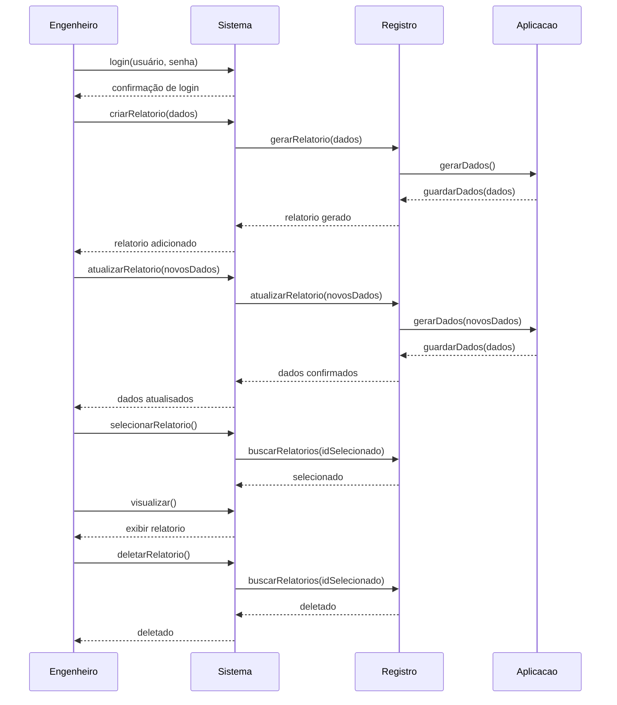

# Relatório Individual - Ítalo J C Pires - 202403128
## Cargo e Tarefas
No início do projeto, me foi atribuída a construção do código-fonte da interface, com as responsabilidades de implementar o ***model-view-controller*** (MVC) e gerenciar o comportamento da **interface** frente ao usuário, garantindo que as classes modelos e de database fossem integrados ao sistema de controle.

Na prática, eu exerci a função de implementar o MVC e gerenciei a integração do projeto, contudo, essas atribuições não foram isoladas, em outras palavras, criar a interface, especialmente frente a etapa 2, exigiu um trabalho conjunto com os integrantes responsáveis pelos modelos, *database* e repositório, visto que ela dependia de todas as classes para funcionar.
## Execução, *Comits*, e Desafios
Devido ao curto prazo antes da apresentação presencial do projeto, não esperava conseguir finalizar a integração do projeto como um todo, que foi responsabilidade minha. Contudo, com a ajuda de todos os integrantes do grupo, por meio de encontros presenciais, conseguimos fazer avanços significativos no projeto que permitiram que as minhas **atribuições de MVC e integração do projeto, fossem concluídas com êxito**. Ficaram pendentes pequenas correções (alguns comportamentos indesejados da *tableview*), embelezamento do código-fonte, e alterações bases que eu gostaria de ter feito na estrutura da interface.

A priori, o trabalho referente ao MVC foi feito numa *branch* separada chamada *SceneBuilder* onde fiz os *comits*, que foi integrada na *branch  main* próximo do final do projeto. Os principais *comits* foram feitos sob o nome de *projectFX*, dentre os quais os mais relevantes foram o primeiro *comit*, que tinha a estrutura base do MVC, o segundo, que tinha atualizações finais importantes para a estrutura do projeto como um todo, e o último, com alterações finais com a integração do projeto.
[Comit de Interface](https://github.com/poo-ee-2025-1/g3/commit/0902a564db5c210be864a23ea9c0a9f5d75b9569)
[Comit 2](https://github.com/poo-ee-2025-1/g3/commit/6c35fe6bfb5da75d6071d20d0930524f1b32b3f0)
As dificuldades mais relevantes que valem citar foram lidar com a *tableview*, devido a falta de recursos áudio-visuais sobre *SceneBuilder* em conjunto com códigos de banco de dados, e lidar com o GitHub, uma vez que foi complexo fazer clonagens de arquivos BlueJ na plataforma Eclipse, assim como aprender a realizar *comits* da forma correta e nos lugares certos. Quanto aos obstáculos de trabalhar simultaneamente com a *tableview* e o banco de dados, fui capaz de apresentar soluções na prática, essas soluções, a priori, não pareciam ser eficientes, mas com a ajuda do grupo percebi que os erros eram simples de resolver, e conseguimos implementá-la.

## Contribuições, Trabalho em Equipe e Intergrupal
Eu contribuí com a equipe participando de discussões e tomadas de decisão sobre alterações estruturais no comportamento de classes e métodos que foram essenciais para que o projeto funcionasse como um todo. Vale notar que os *comits* finais realizados na *branch main* foram contribuição de todos os integrantes da equipe.
  
É importante mencionar que houve um forte trabalho em equipe na etapa 2, o que incluiu encontros presenciais para a integração do projeto, e solução de problemas gerais tanto de cada parte quanto do conjunto delas. A finalização da interface, por exemplo, só foi possível com o auxílio do João Moynier, que auxiliou no código fonte do *controller Scene1Controller*, explicando cuidadosamente as linhas de código referente às classes do banco de dados e do criador HTML, lidando com criação de objetos necessários, chamamento dos métodos corretos, e adaptação do criador HTML para a entrega do projeto dentro do prazo. A equipe realizou, por fim, um encontro presencial para a finalização do projeto.
****
Vale mencionar, também, que houve trabalho intergrupal, em especial com o Ricardo Cardoso do grupo 8, que inicialmente forneceu referências de material áudio-visual para o estudo de *javaFX* em projetos com *SceneBuilder*, assim como se dispôs a explicar as configurações básicas do MVC, fez sugestões de uso de interfaces como Eclipse e IntelliJ, mencionou e ajudou a começar o css para como ferramenta para estilizar o projeto. Também compartilhou suas ideias iniciais do seu projeto, mostrando o avanço da interface do seu grupo, o que contribuiu para o direcionamento do nosso próprio projeto inicial e ideias finais como a geração de relatórios em formato HTML de forma automatizada.

## Considerações Gerais
O trabalho em equipe geralmente é muito caótico porque cada pessoa, individualmente, tem uma interpretação única de como o projeto vai funcionar no final, e trabalha no seu código fonte para suprir essa expectativa, o que leva a conflitos estruturais entre as partes. Contudo, ficou muito claro para mim as vantagens do trabalho em equipe e do trabalho intergrupal, como alusão à interdisciplinaridade, através disso houve análises e correções eficazes, permitindo que erros complexos fossem corrigidos de forma simples e rápida, entregando um projeto funcional dentro do prazo.

Pessoalmente, como o aprendizado das ferramentas GitHub, *javaFX*, *SceneBuilder*, foi um processo que aconteceu simultaneamente com a construção do projeto, se eu começa-se ele do zero iria por um caminho diferente, já pensando no produto final, por exemplo, eu gostaria de ter investido mais nas ferramentas do *SceneBuilder*, como *panes* e *nodes*, usando complexos de *Vbox*, *Hbox*, e dentre outros agora que seu uso é claro.
## Diagrama de Sequência
Diagrama de Sequência sobre o funcionamento do CRUD frente ao usuário

## Fontes
A maior parte do projeto *javaFX* com *SceneBuilder* foi baseada de fontes áudio-visuais. Para solução de problemas mais complexos, no entanto,  como os relacionados a *tableview* e ao *banco de dados*, recorri, além dos vídeos, aos tutorias disponíveis no GitHub, em que fiz análises das linhas de código adaptando elas para o projeto.
**Quanto ao projeto MVC em *javaFX* com *SceneBuilder*:**
[Playlist de vídeos sobre javaFX e SceneBuilder](https://youtube.com/playlist?list=PLZPZq0r_RZOM-8vJA3NQFZB7JroDcMwev&si=HfnJjuIttpiCVI_i)...

**Quanto à *tableview*:**
[Vídeo 1 sobre TableView](https://youtu.be/3s8s0vyfLV8?si=huN8uALC2ruQb9AC)
[Vídeo 2 sobre TableView](https://youtu.be/qQcr_JMxWRw?si=yaa7LHeQOvQNevEZ)
[Vídeo 3 sobre TableView](https://youtu.be/BYj2NBjiLDY?si=rbvIiKv55K5RzG76)
[Link do tutorial CRUD](https://github.com/poo-ee-2025-1/tutorials/blob/main/javafx-crud/README.md)
[Link do tutorial de JavaFX e Tableview](https://medium.com/@antonio.gabriel/javafx-trabalhando-com-tableview-5cc1065babab)

**Quanto ao banco de dados:**
[Link do ORM](https://github.com/poo-ee-2025-1/tutorials/blob/main/orm/README.md) (Usado para corrigir problemas na integração do banco de dados)
[Link do tutorial CRUD](https://github.com/poo-ee-2025-1/tutorials/blob/main/javafx-crud/README.md)