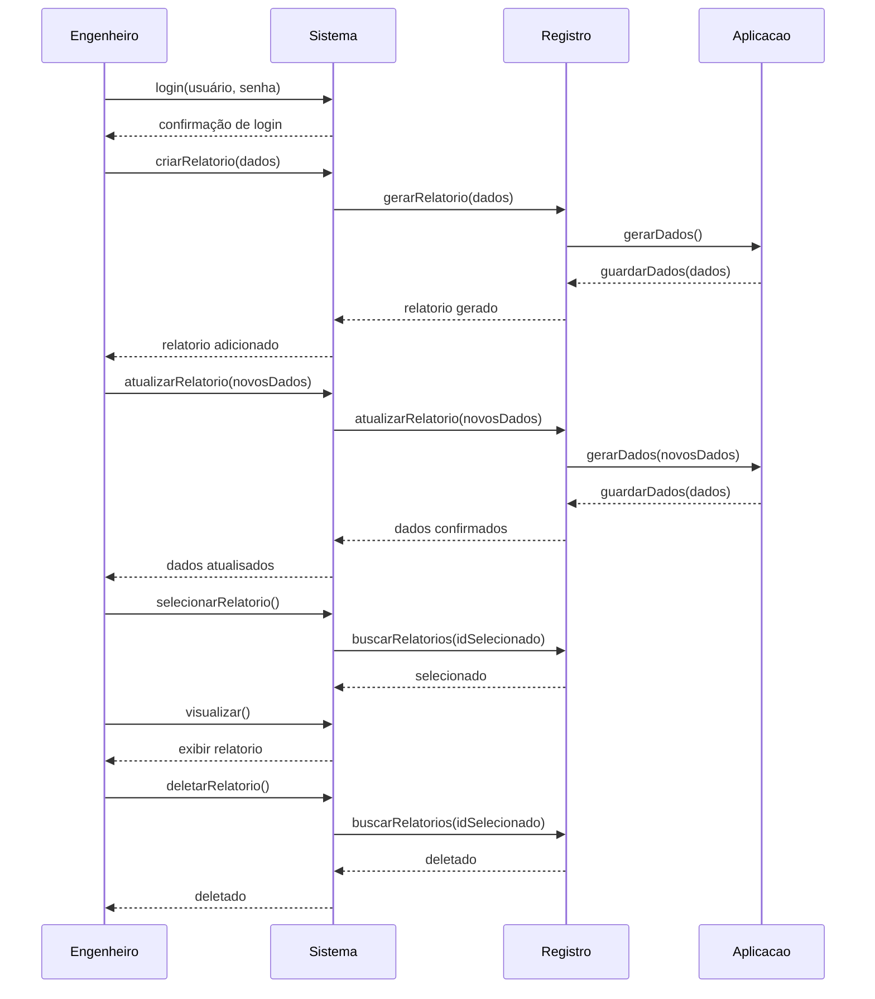

```mermaid
sequenceDiagram
Engenheiro ->> Sistema : login(usuário, senha)
Sistema -->> Engenheiro : confirmação de login
Engenheiro ->> Sistema : criarRelatorio(dados)
Sistema ->> Registro : gerarRelatorio(dados)
Registro ->> Aplicacao : gerarDados()
Aplicacao -->> Registro : guardarDados(dados)
Registro -->> Sistema : relatorio gerado
Sistema -->> Engenheiro : relatorio adicionado
Engenheiro ->> Sistema : atualizarRelatorio(novosDados)
Sistema ->> Registro : atualizarRelatorio(novosDados)
Registro ->> Aplicacao : gerarDados(novosDados)
Aplicacao -->> Registro : guardarDados(dados)
Registro -->> Sistema : dados confirmados
Sistema -->> Engenheiro : dados atualisados
Engenheiro ->> Sistema : selecionarRelatorio()
Sistema ->> Registro : buscarRelatorios(idSelecionado)
Registro -->> Sistema : selecionado
Engenheiro ->> Sistema : visualizar()
Sistema -->> Engenheiro : exibir relatorio
Engenheiro ->> Sistema : deletarRelatorio()
Sistema ->> Registro : buscarRelatorios(idSelecionado)
Registro -->> Sistema : deletado
Sistema -->> Engenheiro : deletado
```
